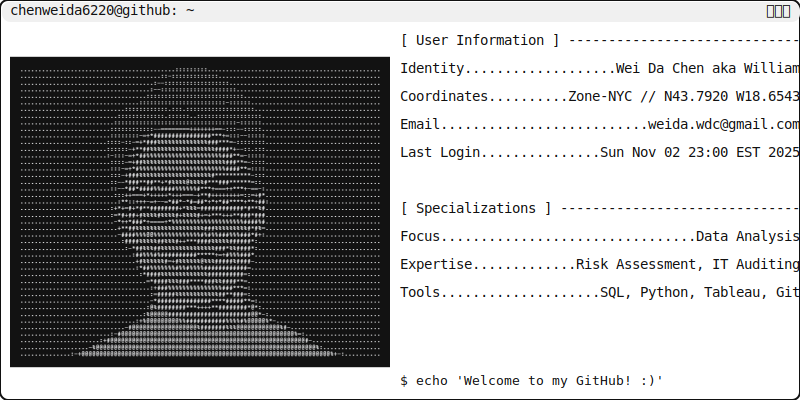

<div align="center">
  
  <br>
  

  <h3>Data-driven problem solver and IT auditor turning complex data into actionable insights.</h3>

[](https://www.linkedin.com/in/dawae/)
[](/Portfolio%20Items/README.md)

<!-- Dynamic shields.io badges -->
<!-- LinkedIn shields.io badge -->
<!-- <a href="http://linkedin.com/in/dawae"> </a>
<!-- GitHub shields.io badge -->
<!-- <a href="/Portfolio Items/README.md"> </a> -->

  <picture>
    <source media="(prefers-color-scheme: dark)" srcset="dark-mode_namecard.svg">
    
  </picture>
</div>

### 📚 My Projects
Welcome to my portfolio, where I showcase my [`< PROJECTS />`](/Portfolio%20Items/README.md).

### 🖥️ Self Doctrine
```
> loading ego_core.dll...
> initializing self.exe...
> "Insanity is doing the same thing over and over again and expecting different results."
> operation complete.
```

<!-- SVG Wave Animation -->


